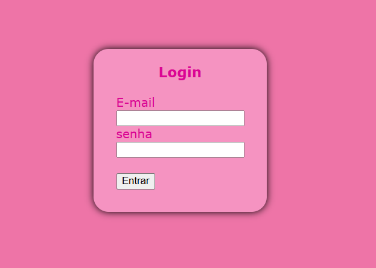

# projeto-login

Projeto variado como parte avaliativa de discipina de Fundamentos de Denvolvimentos ministrada pelo professor Leonardo Rocha

## índice
* [Descrição](#descrição)
* [Tecnologias](#tecnologias)
* [Referência](#rêferências)
* [Autor(a)](#autora)

## Descrição

Esse projeto consiste na construção de uma página de login, para você se cadastrar em um aplicativo.

## Resultado do projeto

## elementos ultilizados

* body - 
* form - 
* container - 
* padding - 
* heigth